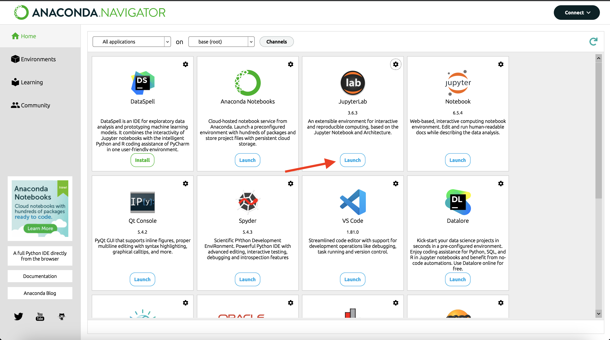
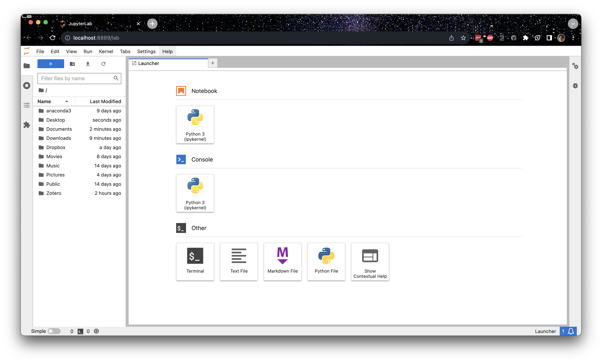
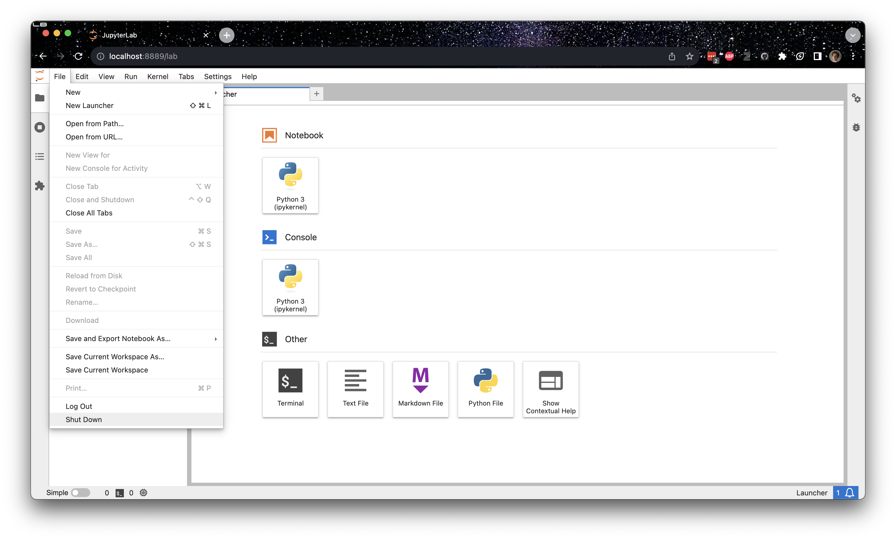

# CMSE 801 Software Setup Guide

As this is a course in computational modeling and data science, you will be completing all of your assignments using your computer! However, in order to do so there are a number of things you need to set up before the course starts.
  
**MAKE SURE TO COMPLETE ALL OF THE SECTIONS LISTED IN THIS DOCUMENT BEFORE YOU COME TO CLASS**

## Getting Zoom

Although the course will be conducted in person, the video conferencing software Zoom will be used for virtual/hybrid office hours, so it is critical to have access to this platform. First, you should download the software, which you can do by going here: [https://msu.zoom.us/support/download](https://msu.zoom.us/support/download).

Once you have the software on your computer, you can **link it to your MSU account** by following the steps laid out [here](https://www.canr.msu.edu/od/educational-technology/zoomlogin)

## Installing Python for this course

Follow the instructions below to get the Anaconda distribution of Python installed on your computer. Even if you already have a version of Python installed on your machine, we encourage you to go through this installation process as the assignments will assume that you are working with the same versions of the Anaconda Python packages that the instructors are using. If you already specifically have Anaconda installed, we encourage you to update all of the Python packages (you may need to look up how to do this).

### Instructions for downloading Anaconda (Python 3)

1. Go to the Anaconda Download webpage: [https://www.anaconda.com/download/](https://www.anaconda.com/download/). You can click "Skip Registration" under the email registration submit button to get to the download page.

2. Select the appropriate operating system (Windows | macOS | Linux) for your computer (it may auto-detect the correct operating system).

3. Download the newest version of Python 3 (64 bit recommended).

4. Follow the online documentation to install Python for your specific operating system: [https://docs.anaconda.com/anaconda/install/](https://docs.anaconda.com/anaconda/install/)

5. Once installed, open the application Anaconda-Navigator. *Note:* At startup you might be prompted to login in your account. Just close this window. You do not need to create an account.

6. Launch Jupyter Lab by clicking on the button Launch, indicated by a red arrow in figure.

    

    If everything goes correctly, a browser window should open up with the Jupyter interface running. If things don't work, don't worry, we will help you get started.

    

7. You can close this window by clicking on `File` in the top left corner of the window and then select `Shut Down` as shown in the figure.

    

## MSU's JupyterHub Interface (a backup option if things fail on your computer)

From time to time, you might run into issues with your computer. When this happens, you can use the web-hosted JupyterHub server managed by MSU. It creates a virtual environment that allows you to run simple commands and host Jupyter notebooks. To make sure that you have access to this backup option, follow the directions below. Note that there are extra steps involved that require that you to upload your Jupyter notebooks to JupyterHub, as well as to download them (in the case of Homework assignments) in order to turn them in on D2L.

**This service should only be used as a temporary fix if Jupyter stops working on your computer.** To make sure that you have access to this backup option, follow the directions below. Note that there are extra steps involved that require that you upload and download your Jupyter notebooks to and from JupyterHub in order to turn them in on D2L.  **Again, this option is meant to be used *as a backup* to your local Python installation and requires and internet connection to use**. It will often be easier to run things locally on your computer.

### Instructions for connecting to the engineering JupyterHub server

Every student enrolled in this class will be given an engineering computing account. If this is your first time using your Engineering account you will need to activate the account by going to the following website:

[https://www.egr.msu.edu/decs/myaccount/?page=activate](https://www.egr.msu.edu/decs/myaccount/?page=activate)

Enter your MSU NetID. **The initial password will be your PID** and then you have to set a password that meets the requirements listed on the page. Verify the password. Then agree to the terms and Activate.  

Once your account is activated you can access the classroom JupyterHub server using the following instructions:

1. Open up a web browser and go to the following URL: [https://jupyterhub.egr.msu.edu](https://jupyterhub.egr.msu.edu)

2. Type your engineering login name. This will be your MSU NetID.

3. Type your engineering password.

If everything is working properly you will see the main “Files” windows in the Jupyter interface.  

If you ever end up working on your assignments using JupyterHub, the remaining directions should serve as a reference for how you can go about uploading and downloading Jupyter notebooks and turning them in.

#### Instructions for getting Jupyter notebook files onto JupyterHub

Jupyter notebooks are files that end with the `.ipynb` extension.  These files can be found on the class website and downloaded using the Download button in the top right.  **Be sure to download them in `.ipynb` format!**

Once you have an ipynb file you can load it into Jupyter using the “upload” button on the main “Files” tab in the Jupyter web interface. Hitting this button will cause a file browser window to open. Just navigate to your ipynb file, select it and hit the open button.

Once you see your filename in the Jupyter window you can just click on that name to start using that file.

#### Instructions for making a copy of Jupyter notebooks from JupyterHub and turning them in

If your notebook needs to be turned in (e.g. Pre-class assignments, Homeworks and Exams), you will need to download the ipynb file from the JupyterHub interface.

1. With the notebook file open in Jupyter, go to the “File” menu, select the “Download as” menu option and then choose “iPython Notebook (.ipynb)”
2. Pick a place to save the file (The desktop is a good choice).
3. Make sure you make a copy of the .ipynb file for your own records.
4. Go to the Desire 2 Learn ([http://d2l.msu.edu](http://d2l.msu.edu)) class site and upload the .ipynb file into the assignment folder.

## Course Communication with MS Teams

We will be using Microsoft Teams as our means of communicating outside of scheduled class times about course content as the semester progresses and you are expected to monitor Teams regularly. We believe that this will provide an excellent avenue to have discussions not only with course instructor and TA but also between you and your fellow classmates.

You should have been automatically enrolled in the Teams channel for this course and a direct link to the course Teams page is available on the course homepage. The Teams page will be activated sometime before the first day of class. If you are having issues, feel free to email the professor or TA.

### Teams usage rules

In order to ensure that Teams is an appropriately used tool that does not become overly time-consuming for the course instructor and TA, we have a list of rules for how
we expect you to use Teams. They are:

1. Before you ask a question, be sure to check the main channel to see if the question has already been answered.
2. The Teams channel is primarily for you, the students, so help each other.
3. The TA will monitor the channel, but will defer to the students to work through things. They will only enter a conversation if students are going down the wrong path and/or there are too few other students involved. However, you should not expect that the TA will always be available. The TA will spend a limited amount of time “logged in” to Teams and we ask that you be respectful of their time.
4. Teams is meant to be used to help you when you are stuck with a minor issue. If you are having major issues or trouble understanding the concept, go to office hours or help room hours as they are meant for more in-depth discussions of course content.
5. The course instructor will check Teams occasionally, but potentially sporadically, primarily to examine progress. While they may offer help, do not rely on it. The instructor will not respond to the same student twice within a 30 minute time interval.
6. Do not post your solutions to out-of-class assignments directly into Teams unless prompted by an instructor.
7. Be courteous to everyone on Teams. Students who are being rude or who are excessively posting might be banned from posting on the course Teams channel.